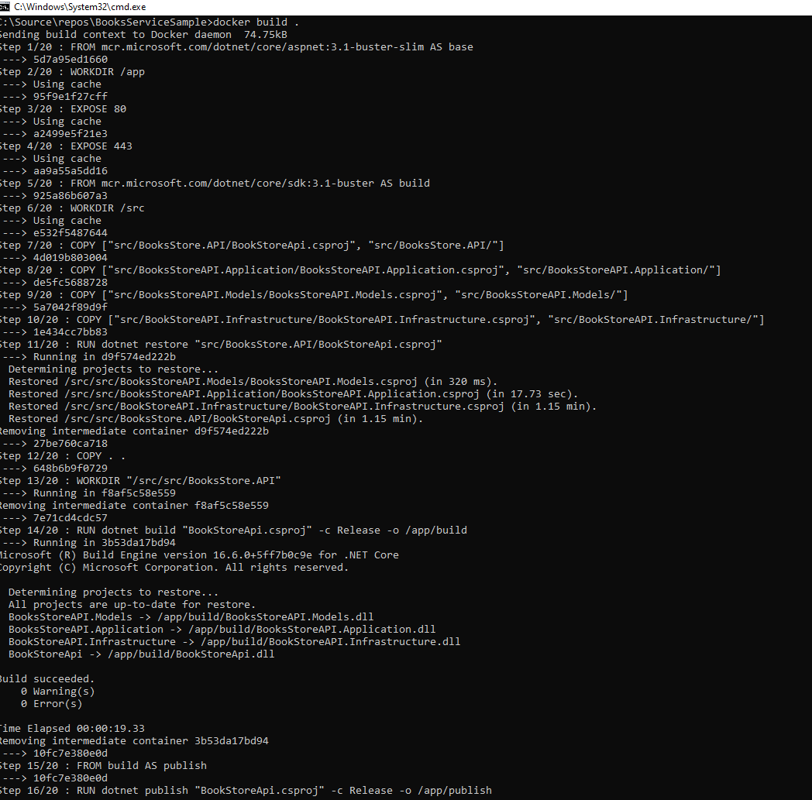
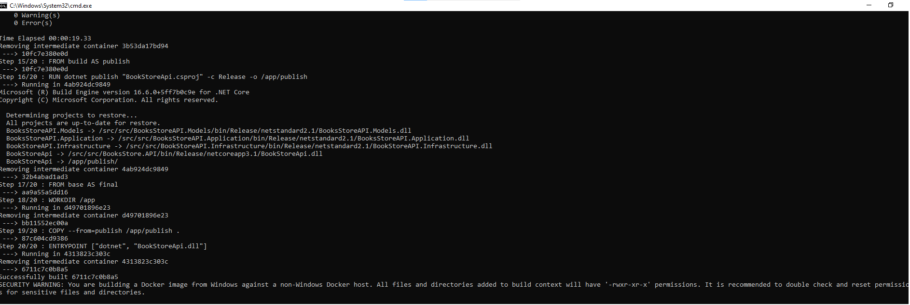

# BookService Placeholder application

This repository contains the bookservice sample app. This application is built to demonstrate CQRS pattern using Mediatr.

#### Solution design
The BookService solution has the following projects

1. [BookStoreApi](#BookStoreApi)
2. [BooksStoreAPI.Models](#BooksStoreAPI.Models)
3. [BooksStoreAPI.Application](#BooksStoreAPI.Application)
4. [BookStoreAPI.Infrastructure](#BookStoreAPI.Infrastructure)
5. [BooksStoreAPI.DataMigration](#BookStoreAPI.DataMigration)

##### BookStoreApi
The BookStoreAPI project represents the front end API layer of the solution. It has controllers which reposnd to the HTTP verbs Post, Put, Get and Delete. This project is implemented as an asp.net core 3.1 web api. 

##### BooksStoreAPI.Models
The BooksStoreAPI.Models project represents the data contract that the API layer uses as part of the HTTP verbs it implements.

##### BooksStoreAPI.Application
The BooksStoreAPI.Application project implements the application layer. It is responsible for creating and dispatching commands that add, remove and updates the models into the persistence layer. It is also responsible for queries which are used to fetch data from the repository layer. This is further used by the Get implementation in the API layer.

##### BooksStoreAPI.Infrastructure
The BooksStoreAPI.Infrastructure project implements the repository layer. It implements the repository and the unit of work pattern to persist data into the database. It also uses EFCore to connect to a SQL server database.

##### BookStoreAPI.DataMigration
The BookStoreAPI.DataMigration project is reponsible to migrate and apply changes to the database schema. This project uses DBUP and embeded scripts to be able to deploy SQL scripts. These SQL scripts are versioned.

## Clone
Clone this repo to your local machine using 

```shell
git clone https://dev.azure.com/YouiENC/rating/_git/BooksServiceSample
```

## Executing locally
1. Pull SQl Server Docker image
```shell
docker pull mcr.microsoft.com/mssql/server
```
2. Run Sql Server in a docker container 
```shell
docker run -e "ACCEPT_EULA=Y" -e "SA_PASSWORD=*Password@123*" -p 1433:1433 --name book-sqlserver -d mcr.microsoft.com/mssql/server
```
3. Check if Sql server is running and can be connected.
```shell
sqlcmd -S .,1433 -U SA -P "*Password@123*"
```
4. Build the application
Run docker build in the BookstoreAPI project.
```shell
Docker build .
```


5. Run the application using Docker run


